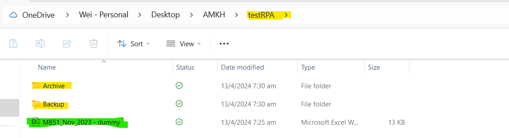
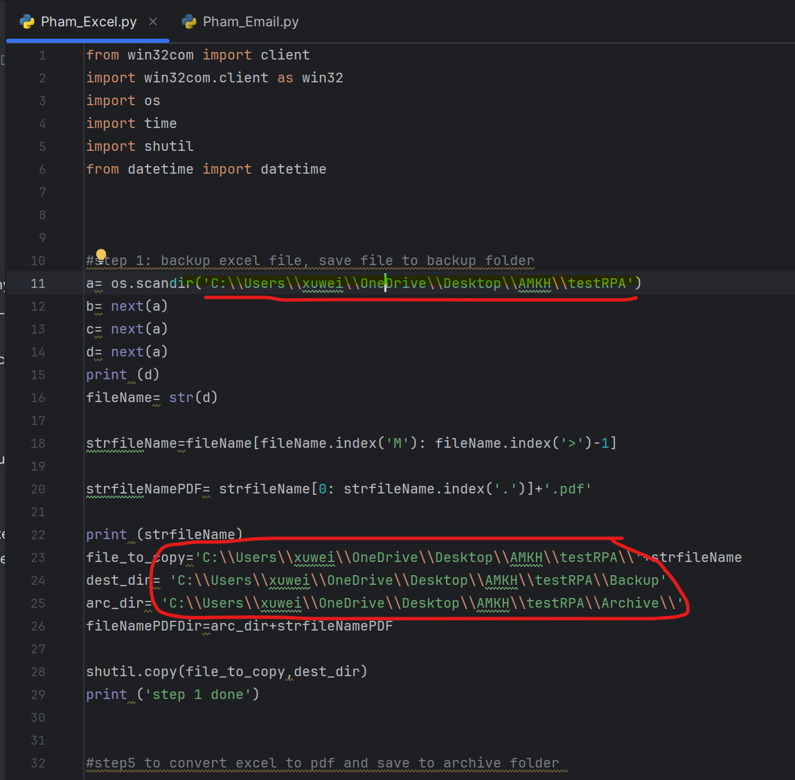

# Devops_RPAProject
For Project2
* This project is to show some basic automation work(excel and email) with Python, please help install Python 3.6 above and editor before you try!

  [Downlaod link](https://www.python.org/downloads/)
  
  

For Pham_Excel:

* Step1: install all needed python library with runnig the script in cmd (pip install pywin32)

  
* Step2: Download all the files to your local pc, create following folders(testRPA, Archive,Backup) in your local pc with your own path. Put the sample excel file to "testRPA" folder.
  
  

* Step3: Open the Pham_Excel python file in any python editor and replace the path in line 11,23,24,25 with your own path. 
  
  

  
* Step4: Run the Pham_Excel python file

For Pham_Email, it works in my work environment because my work account has access to my company's email server. So for normal users the configuration settings need to be tweaked a bit, you can refer to this code and change it according to your needs or wait for my next update.

